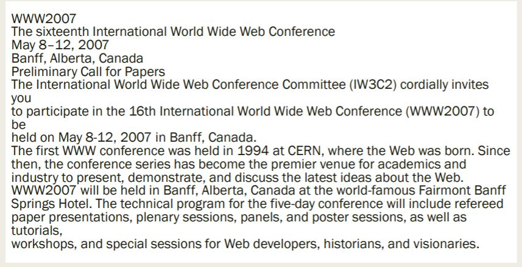
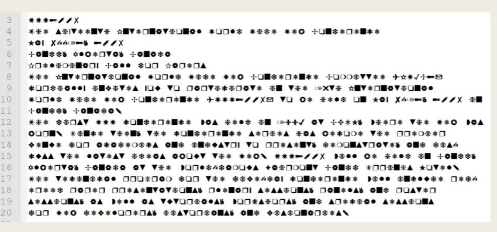
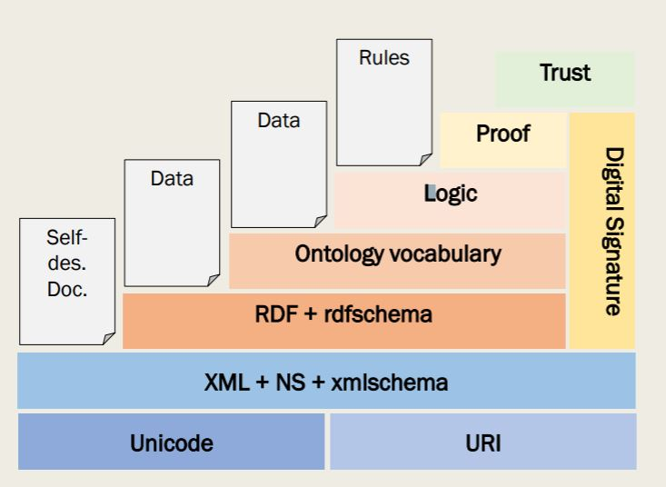

# Semantic web

### what is Semantic web 
    Web tech timeline
#### 1. File System
    - Email
    - FTP
    - IRC
    - USENENT
    - PC's
#### 2. PC Era 
    - ช่วงของ OS
#### 3. Web 1.0
    เว็บในการจัดการความรู้ที่ชัดเจน.
    Application:
        HTML Document Web-Database
        VR,Gopper,SQL,BBS,HTTP,SOAP
#### 4. Web 2.0
    เทคโนโลยีการจัดการความรู้โดยปริยาย
    Application:
        Wiki, Blogs, Social Network
    Tech
        JS,JAVA,XML,PDF,P2P,RSS,OPENID
#### 5. Web 3.0
    ความรู้เชิงความหมายการจัดการ
    Application:
        Ontology, Intelligent Agent, QuestionAnswering
        Sematic Search,Semantic DB,Widget
    Tech
        OWL,SPARQL,SWRL,ATOM
### What is the problem
    เนื้อหาที่อยู่บนหน้าเว็บเราสามารถอ่านเข้าใจได้เเต่ computer (เครื่องจักร)
#### สิ่งที่คนเห็น
   
#### สิ่งที่ computer เห็น
   
### WWW vs Semantic Web
    -  WWW is a web of documents ก็คือ web ธรรมดา
    -  SW is a web of data  web เชิงข้อมูล
    -  WWW documents are human readable web ที่คนอ่านได้
    -  SW data is machine readable (in theory at least) web ที่ เครื่องจักรก็อ่านได้
### Ontologies
    เป็นข้อกำหนดที่ชัดเจนและเป็นทางการของการสร้างแนวความคิด
    การศึกษาลักษณะของการดำรงอยู่
### Typical Components of Ontologies 
    ส่วนประกอบของ ontology
#### terms 
    เเสดงถึงเเนวคิดหลังที่สำคัญ
#### Relationships
    ความสัมพันธ์ของ terms มีรูปเเบบเป็นลำดับชั้น
#### Properties
    e.g. X teaches Y
#### Value restrictions
    e.g. only faculty members can teach courses
#### Disjointness statements
    e.g. faculty and general staff are disjoint
#### Logical relationships between objects
    e.g. every department must include at least 10 faculty
#### Example of a Class Hierarchy
   
### Ontology language
    ■ XML (Extensible markup language)
    ■ RDF (Resource description framework)
    ■ OWL (Web ontology language)
    ■ SWRL (Semantic Web Rule Language)
    ■ SPARQL Query Language
### The Semantic Web Layer Tower
   
### Semantic Web Layers
#### XML layer
    – Syntactic basis
#### RDF layer
    – RDF basic data model for facts
    – RDF Schema simple ontology language
#### Ontology layer
    – More expressive languages than RDF Schema
    – Current Web standard: OWL
#### Logic layer
    – enhance ontology languages further
    – application-specific declarative knowledge
#### Proof layer
    – Proof generation, exchange, validation
#### Trust layer
    – Digital signatures
    – recommendations, rating agencies …. 

### XLM 

#### XML vs HTML
   xml จะเป็นภาษาที่มีโครงสร้างของ Tag ที่ชัดเจน เเล้วมีความสมพันธ์ระหว่าง  tag

   ``` xml
        <?xml version="1.0" encoding="UTF-8"?>
        <note>
            <to>Tove</to>
            <from>Jani</from>
            <heading>Reminder</heading>
            <body>Don't forget me this weekend!</body>
        </note>
   ```
   machaine สามารถอ่านรู้เรื่อง

#### XML Elememts
   - xlm ประกอบด้วย หลาย elememt
   - ประกอบด้วย open tag  and close tag

     ``` xml
            <lecturer>Phumai</lecturer> 
     ``` 
   - tag name สามารถตั้งยังงัยก็ได้(เเต่ต้องตั้งชื่อให้สือความหมาย)
   - ตัวเเรกก็ความเป็น ตัว อักษร _ ,
   - ไม่ควรเอาคำสงวนมาตั้ง etc "Xml" ,"xML"
##### Content of XML Elements
   ของที่อยู่ใน element 

   ``` xml
        <food>
            <name>Strawberry Belgian Waffles</name>
            <price>$7.95</price>
            <description>
            Light Belgian waffles covered with strawberries and whipped cream
            </description>
            <calories>900</calories>
        </food>
   ```
##### XML Attributes
   เขียนข้อมูลภายใน tag เปิด เพื่อง่ายต่อการจัดรูปเเบบการเเสดงผล เเล้วง่าย
   ไม่สามารถเขียน เเบบ nest ได้ เหมือน element ขื่อห้ามช้ำ
   ``` xml
        <food>
            <name name ="Strawberry Belgian Waffles"></name>
            <price price = "$7.95"></price>
        </food>
   ```
#### Well-Formed XML Documents
   ถูกตามหลัก
   ต้องมี root node หรือ มี tag หนึง tag ครอบอยู
   ทุก open tag ต้องมี tag close
   tag not overlap

   ``` xml
        <name><lastname>jenf<name></lastname>
   ```
   attributes ต้อง unique
   Element and tag names must be permissible

#### The Tree Model of XML Documents: An Example
    
   
   ``` xml
        <?xml version="1.0" encoding="UTF-8"?>
        <bookstore>
        <book category="cooking">
            <title lang="en">Everyday Italian</title>
            <author>Giada De Laurentiis</author>
            <year>2005</year>
            <price>30.00</price>
        </book>
        <book category="children">
            <title lang="en">Harry Potter</title>
            <author>J K. Rowling</author>
            <year>2005</year>
            <price>29.99</price>
        </book>
        <book category="web">
            <title lang="en">Learning XML</title>
            <author>Erik T. Ray</author>
            <year>2003</year>
            <price>39.95</price>
        </book>
        </bookstore>
   ```

### Structuring XML Documents
    มีการกำหนดเอกสาร XML ก่อน จะทำการเขียน XML (กำหนดโครงสร้าง) มี 2 เเบบหลัก ๆ
    - DTDs
    - XML schema *

#### DTD
    ``` xml
        <lecturer>
            <name>Dvaic  Billingto</name>
            <phone>+66 -7 - 38462 507</phone>
        </lecturer>
  
    - define DTD

   
        <!ELEMENT lecturer (name,phone) >
        <!ELEMENT name (#PCDATA) >
        <!ELEMENT phone (#PCDATA) >
    ```
    

#### XML Schema

    ``` xml
        <schema "http://www.w3.org/2000/10/XMLSchema" version = "1.0">
        <element name="email"/>
        <elememt name="head" minOccurs="1" maxOccurs="1"/> 
        <element name="to" minOccurs="1"/>

        <attribute name="id" type="ID" use="required"/>
    ```
##### Complex data types
    - sequence มีระดับการเขียนที่ตายตัว เรียงลำดับ
    - all เลือกอะไรก็ได้ มาก่อนมาหลัง เเต่ต้องเลือกให้ครบ
    - choice เลือออะไรก็ได้ ไม่ครบก็ได้

#### Nampspace


### RDF 
    ------------เรืองที่เรียนมาเเต่ก่อน---------------
    XML mate lang 
    inter exchange palform
    machine ต้องเข้าใจ
    XML สร้างในเชิงโครงสร้างได้ เเต่ใช้ในเชิงความหมายไม่ได้
    -------------RDF--------------
    จะอธิบาย
#### องค์ประกอบ ของ RDF
    - resources 
    - properties
    - statement

#### Resources (RDF)
    - object 
    - ประกอบด้วยหลาย statement
    - URI ที่อ้างอิงเเหลงข้อมูลจัดเก็บ

#### Properties
    จะอธิบาย resoces/object

#### Data Types
    - datatype เดียว string / riteral
### RDF schema
    - อะิบาย RDF 

    - domain range ต้องมีความสัมพันธ์กัน
    - 

    
